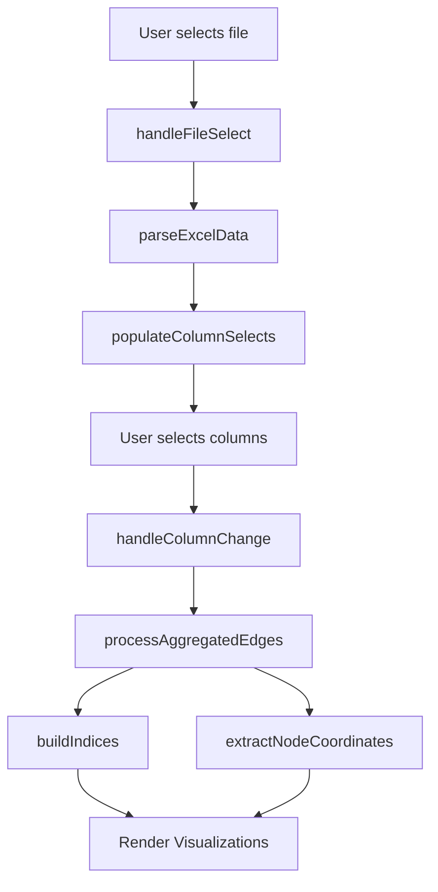

## Overview

Data processing functions handle the entire pipeline from Excel file upload to creating aggregated edges and indices ready for visualization.

## File Handling

### handleFileSelect

```javascript
async function handleFileSelect(event)
```

Handles Excel file selection from the file input, reads the workbook, and initiates data parsing.

<Note>
  Defined in `app.js:86-128`
</Note>

#### Parameters

<ParamField path="event" type="Event" required>
  Change event from the file input element containing the selected file
</ParamField>

#### Behavior

<Steps>
  <Step title="Validate File">
    Checks if a file was selected and if XLSX library is loaded
  </Step>
  <Step title="Update State">
    Stores the file object and filename in `appState`
  </Step>
  <Step title="Read Workbook">
    Reads the file as an ArrayBuffer and parses it with XLSX.read()
  </Step>
  <Step title="Sheet Selection">
    If multiple sheets exist, prompts user to select one
  </Step>
  <Step title="Parse Data">
    Calls `parseExcelData()` to extract headers and rows
  </Step>
</Steps>

#### Error Handling

- Shows error message if XLSX library is not loaded
- Shows error message if file reading fails
- Shows error message if sheet selection is cancelled

#### Example

```javascript
// Attach to file input
const fileInput = document.getElementById('fileInput');
fileInput.addEventListener('change', handleFileSelect);
```

---

### parseExcelData

```javascript
function parseExcelData(workbook)
```

Parses the selected Excel worksheet and extracts headers and data rows.

<Note>
  Defined in `app.js:133-178`
</Note>

#### Parameters

<ParamField path="workbook" type="XLSX.WorkBook" required>
  Parsed workbook object from XLSX library
</ParamField>

#### Behavior

<Steps>
  <Step title="Get Worksheet">
    Retrieves the worksheet using `appState.sheet` name
  </Step>
  <Step title="Convert to JSON">
    Uses `XLSX.utils.sheet_to_json()` with empty cells as empty strings
  </Step>
  <Step title="Extract Headers">
    Gets column names from the keys of the first data object
  </Step>
  <Step title="Validate Data">
    Checks that headers and rows are not empty
  </Step>
  <Step title="Update State">
    Populates `appState.headers`, `appState.rows`, and sets `isValid = true`
  </Step>
  <Step title="Populate UI">
    Calls `populateColumnSelects()` to fill dropdown menus
  </Step>
</Steps>

#### Updates State

- `appState.headers` - Array of column names
- `appState.rows` - Array of row objects
- `appState.isValid` - Set to `true` if data is valid

#### Example

```javascript
// Called internally by handleFileSelect
const workbook = XLSX.read(arrayBuffer, { type: 'array' });
parseExcelData(workbook);

// After parsing, state contains:
console.log(appState.headers); // ["Origin", "Destination", "Weight", ...]
console.log(appState.rows.length); // 1500
```

---

## Column Configuration

### handleColumnChange

```javascript
function handleColumnChange()
```

Handles changes to column selections (origin, destination, weight, coordinates) and triggers data processing.

<Note>
  Defined in `app.js:220-293`
</Note>

#### Parameters

None - reads values from DOM select elements

#### Behavior

<Steps>
  <Step title="Read Selection">
    Gets selected values from all column dropdowns
  </Step>
  <Step title="Update State">
    Stores column names in `appState.originCol`, `destCol`, etc.
  </Step>
  <Step title="Validate Selection">
    Ensures origin and destination are not the same column
  </Step>
  <Step title="Process Data">
    Calls `processAggregatedEdges()` if both origin and dest are selected
  </Step>
  <Step title="Populate Filters">
    Fills filter dropdowns with unique values from selected columns
  </Step>
  <Step title="Render Visualizations">
    Calls render functions for Sankey, Network, and Map (if coordinates exist)
  </Step>
</Steps>

#### Validation

```javascript
// Prevents selecting the same column for origin and destination
if (originCol === destCol && originCol !== '') {
  showConfig('⚠ Origin and Destination cannot be the same column.', 'warning');
  // Resets selection
}
```

#### Example Usage

```javascript
// Attach to column select elements
const originCol = document.getElementById('originCol');
const destCol = document.getElementById('destCol');
originCol.addEventListener('change', handleColumnChange);
destCol.addEventListener('change', handleColumnChange);
```

---

## Data Processing

### processAggregatedEdges

```javascript
function processAggregatedEdges()
```

Processes raw data rows into aggregated edges with summed weights and counts.

<Note>
  Defined in `app.js:339-378`
</Note>

#### Parameters

None - uses `appState.rows`, `originCol`, `destCol`, `weightCol`

#### Algorithm

<Tabs>
  <Tab title="Aggregation">
    ```javascript
    // Creates a Map with key "source|target"
    const edgesMap = new Map();
    
    rows.forEach(row => {
      const source = String(row[originCol] ?? '').trim();
      const target = String(row[destCol] ?? '').trim();
      const key = `${source}|${target}`;
      const weight = weightCol ? parseFloat(row[weightCol]) || 1 : 1;
      
      if (edgesMap.has(key)) {
        edge.value += weight;  // Sum weights
        edge.count += 1;       // Count occurrences
      } else {
        edgesMap.set(key, { source, target, value: weight, count: 1 });
      }
    });
    ```
  </Tab>
  <Tab title="Node Collection">
    ```javascript
    // Collects unique node names
    appState.uniqueNodes.add(source);
    appState.uniqueNodes.add(target);
    ```
  </Tab>
  <Tab title="Edge Array">
    ```javascript
    // Converts Map to array
    appState.aggregatedEdges = Array.from(edgesMap.values());
    ```
  </Tab>
</Tabs>

#### Returns

<ResponseField name="appState.aggregatedEdges" type="Edge[]">
  Array of aggregated edges with structure:
  ```typescript
  {
    source: string,    // Origin node name
    target: string,    // Destination node name
    value: number,     // Sum of weights
    count: number      // Number of rows aggregated
  }
  ```
</ResponseField>

<ResponseField name="appState.uniqueNodes" type="Set<string>">
  Set of all unique node names encountered
</ResponseField>

#### Side Effects

- Calls `buildIndices()` to create index structures
- Logs processing statistics to console

#### Example

```javascript
// After processing, state contains aggregated edges
processAggregatedEdges();

console.log(appState.aggregatedEdges);
// [
//   { source: "NYC", target: "LA", value: 150, count: 3 },
//   { source: "NYC", target: "SF", value: 200, count: 5 },
//   ...
// ]

console.log(appState.uniqueNodes.size); // 25
```

---

### buildIndices

```javascript
function buildIndices()
```

Builds outgoing and incoming edge indices for fast node lookups.

<Note>
  Defined in `app.js:383-400`
</Note>

#### Parameters

None - uses `appState.aggregatedEdges`

#### Creates Indices

<Tabs>
  <Tab title="Out Index">
    Maps each source node to its outgoing edges:
    ```javascript
    appState.outIndex = new Map();
    // "NYC" -> [
    //   { source: "NYC", target: "LA", value: 150 },
    //   { source: "NYC", target: "SF", value: 200 }
    // ]
    ```
  </Tab>
  <Tab title="In Index">
    Maps each target node to its incoming edges:
    ```javascript
    appState.inIndex = new Map();
    // "LA" -> [
    //   { source: "NYC", target: "LA", value: 150 },
    //   { source: "SF", target: "LA", value: 100 }
    // ]
    ```
  </Tab>
</Tabs>

#### Performance

Indices enable O(1) lookup of edges for a given node, critical for:
- Ego network generation
- Node detail popups
- Neighborhood highlighting

#### Example

```javascript
// Build indices after processing edges
buildIndices();

// Fast lookup of outgoing edges
const outEdges = appState.outIndex.get("NYC") || [];
console.log(`NYC has ${outEdges.length} outgoing connections`);

// Fast lookup of incoming edges
const inEdges = appState.inIndex.get("LA") || [];
console.log(`LA receives from ${inEdges.length} sources`);
```

---

## Coordinate Extraction

### extractNodeCoordinates

```javascript
function extractNodeCoordinates()
```

Extracts geographic coordinates for nodes from configured lat/lng columns.

<Note>
  Defined in `app.js:1619-1676`
</Note>

#### Parameters

None - uses `appState.rows` and coordinate column configuration

#### Behavior

<Steps>
  <Step title="Check Configuration">
    Verifies that at least origin or destination coordinate columns are set
  </Step>
  <Step title="Clear Previous Data">
    Clears `appState.nodeCoordinates` Map
  </Step>
  <Step title="Extract Origin Coords">
    If `originLatCol` and `originLngCol` are set, extracts coordinates for origin nodes
  </Step>
  <Step title="Extract Dest Coords">
    If `destLatCol` and `destLngCol` are set, extracts coordinates for destination nodes
  </Step>
  <Step title="Validate Values">
    Parses lat/lng as floats and checks for NaN
  </Step>
  <Step title="Store Coordinates">
    Stores valid coordinates in `nodeCoordinates` Map (first occurrence wins)
  </Step>
</Steps>

#### Updates State

<ResponseField name="appState.nodeCoordinates" type="Map<string, {lat: number, lng: number}>">
  Map of node names to their geographic coordinates
</ResponseField>

<ResponseField name="appState.nodesWithOriginCoords" type="Set<string>">
  Set of nodes that have coordinates as origins
</ResponseField>

<ResponseField name="appState.nodesWithDestCoords" type="Set<string>">
  Set of nodes that have coordinates as destinations
</ResponseField>

#### Example

```javascript
// Configure coordinate columns
appState.originLatCol = "Origin_Lat";
appState.originLngCol = "Origin_Lng";
appState.destLatCol = "Dest_Lat";
appState.destLngCol = "Dest_Lng";

// Extract coordinates
extractNodeCoordinates();

// Check results
console.log(`Extracted coordinates for ${appState.nodeCoordinates.size} nodes`);

const nycCoords = appState.nodeCoordinates.get("NYC");
if (nycCoords) {
  console.log(`NYC: ${nycCoords.lat}, ${nycCoords.lng}`);
}
```

---

## Helper Functions

### populateColumnSelects

```javascript
function populateColumnSelects()
```

Populates all column selection dropdown menus with headers from the loaded data.

<Note>
  Defined in `app.js:183-215`
</Note>

#### Updates Elements

- `originCol` select
- `destCol` select
- `weightCol` select (includes "-- Automatic (count) --" option)
- `originLatCol`, `originLngCol`, `destLatCol`, `destLngCol` selects (include "-- Optional --")
- Ego network destination selects (4 panels)

---

### populateEgoDestinations

```javascript
function populateEgoDestinations()
```

Populates ego network destination selects with unique values from the destination column.

<Note>
  Defined in `app.js:298-334`
</Note>

#### Parameters

None - uses `appState.destCol` and `appState.rows`

#### Behavior

- Extracts unique values from the selected destination column
- Sorts values alphabetically
- Populates all 4 ego network select elements
- Includes HTML escaping for safety

---

## Data Flow Diagram



## Related Documentation

- [App State](/api/app-state) - Global state object documentation
- [Rendering Functions](/api/rendering) - Visualization rendering functions