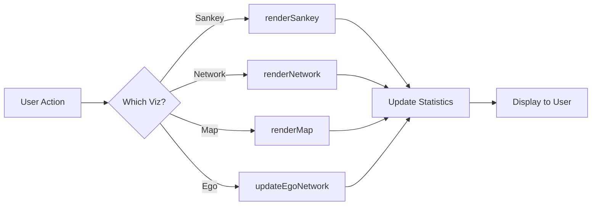

## Overview

Rendering functions transform processed data into interactive visualizations using D3.js, vis-network, and Leaflet libraries.

## Sankey Diagram

### renderSankey

```javascript
function renderSankey()
```

Renders an interactive Sankey diagram showing top-N flows between nodes with zoom and filtering capabilities.

<Note>
  Defined in `app.js:1075-1335`
</Note>

#### Parameters

None - uses `appState` for configuration and data

#### Features

<CardGroup cols={2}>
  <Card title="Interactive Zoom" icon="magnifying-glass">
    Pan and zoom with mouse/trackpad. Reset button available.
  </Card>
  <Card title="Node Filtering" icon="filter">
    Click nodes to highlight connected flows and dim others.
  </Card>
  <Card title="Top-N Selection" icon="sliders">
    Show top 5-500 flows by weight with real-time updates.
  </Card>
  <Card title="Origin/Dest Filters" icon="filter-list">
    Filter to specific origin or destination nodes.
  </Card>
</CardGroup>

#### Algorithm

<Steps>
  <Step title="Filter Edges">
    Apply origin/destination filters to `aggregatedEdges`
  </Step>
  <Step title="Sort & Slice">
    Sort by weight descending and take top-N edges
  </Step>
  <Step title="Extract Nodes">
    Collect unique nodes from filtered edges
  </Step>
  <Step title="Compute Layout">
    Use `d3.sankey()` to calculate node positions and link paths
  </Step>
  <Step title="Render SVG">
    Draw links, nodes, and labels with D3.js
  </Step>
  <Step title="Add Interactions">
    Attach zoom behavior and click handlers
  </Step>
  <Step title="Update Statistics">
    Display link counts and weight sums in UI
  </Step>
</Steps>

#### Configuration

Reads from `appState`:
- `sankeyTopN` - Number of flows to display (default: 50)
- `sankeyOriginFilter` - Origin node filter
- `sankeyDestFilter` - Destination node filter
- `aggregatedEdges` - Source data

#### Updates State

```typescript
appState.sankeyStats = {
  totalLinks: number,        // Total edges in dataset
  totalWeight: number,       // Sum of all edge weights
  displayedLinks: number,    // Edges shown in diagram
  displayedWeight: number    // Sum of displayed edge weights
}
```

#### Visual Design

- **Links**: Bezier curves with thickness proportional to weight
- **Nodes**: Vertical bars with height proportional to total flow
- **Colors**: d3.schemeCategory10 palette based on target node
- **Labels**: Positioned left/right based on node position

#### Interaction Details

<Tabs>
  <Tab title="Node Click">
    ```javascript
    // Click a node to highlight its connections
    // - Selected node and connected nodes: opacity 1.0
    // - Unconnected nodes: opacity 0.2
    // - Connected links: opacity 0.8
    // - Unconnected links: opacity 0.08
    // Click again to deselect
    ```
  </Tab>
  <Tab title="Zoom Controls">
    ```javascript
    // Mouse wheel: Zoom in/out
    // Mouse drag: Pan the diagram
    // + button: Zoom in 1.2x
    // - button: Zoom out 0.833x
    // Reset button: Return to initial view
    ```
  </Tab>
  <Tab title="Tooltips">
    ```javascript
    // Hover over link:
    // "Source → Target\n[weight] referrals"
    
    // Hover over node:
    // "Node Name\n[total flow] flujos"
    ```
  </Tab>
</Tabs>

#### Example Usage

```javascript
// Render with default settings
renderSankey();

// Update top-N and re-render
appState.sankeyTopN = 100;
renderSankey();

// Filter to specific origin
appState.sankeyOriginFilter = "New York";
renderSankey();

// Check statistics after rendering
console.log(`Showing ${appState.sankeyStats.displayedLinks} of ${appState.sankeyStats.totalLinks} links`);
```

#### Related Functions

- `updateSankeyTopN(value)` - Updates top-N setting (app.js:898)
- `updateSankeyFilters()` - Updates filter settings (app.js:910)
- `sankeyZoom(scale)` - Programmatic zoom control (app.js:925)
- `sankeyZoomReset()` - Resets zoom to default (app.js:933)

---

## Network Graph

### renderNetwork

```javascript
function renderNetwork()
```

Renders an interactive force-directed network graph using vis-network with physics simulation.

<Note>
  Defined in `app.js:1339-1614`
</Note>

#### Parameters

None - uses `appState` for configuration and data

#### Features

<CardGroup cols={2}>
  <Card title="Force Layout" icon="magnet">
    Barnes-Hut physics simulation for natural node positioning
  </Card>
  <Card title="Neighborhood Highlighting" icon="circle-nodes">
    Click nodes to highlight immediate neighbors
  </Card>
  <Card title="Node Sizing" icon="circle">
    Node size proportional to total referral weight
  </Card>
  <Card title="Edge Scaling" icon="arrow-right-arrow-left">
    Edge thickness scaled by weight
  </Card>
</CardGroup>

#### Algorithm

<Steps>
  <Step title="Filter & Sort">
    Apply filters and sort edges by weight
  </Step>
  <Step title="Take Top-N">
    Select top-N edges (default: 100)
  </Step>
  <Step title="Build Node Map">
    Map node names to numeric IDs
  </Step>
  <Step title="Calculate Degrees">
    Sum incoming + outgoing weights for each node
  </Step>
  <Step title="Scale Sizes">
    Map degree values to visual sizes (15-100 radius)
  </Step>
  <Step title="Create Network">
    Initialize vis-network with data and physics options
  </Step>
  <Step title="Setup Interactions">
    Attach selection and highlight event handlers
  </Step>
</Steps>

#### Configuration

Reads from `appState`:
- `networkTopN` - Number of edges to display (default: 100)
- `networkOriginFilter` - Origin node filter
- `networkDestFilter` - Destination node filter
- `aggregatedEdges` - Source data

#### Updates State

```typescript
appState.networkStats = {
  totalLinks: number,        // Total edges in dataset
  totalWeight: number,       // Sum of all edge weights
  displayedLinks: number,    // Edges shown in graph
  displayedWeight: number    // Sum of displayed edge weights
}
```

#### Physics Settings

```javascript
const options = {
  physics: {
    enabled: true,
    barnesHut: {
      gravitationalConstant: -8000,
      centralGravity: 0.5,
      springLength: 250,
      springConstant: 0.02,
      damping: 0.95,
      avoidOverlap: 0.2
    },
    stabilization: {
      iterations: 200,
      fit: true
    }
  }
}
```

#### Node Representation

<Tabs>
  <Tab title="Size Calculation">
    ```javascript
    // Calculate total weight for each node (in + out)
    const degree = {};
    displayedEdges.forEach(edge => {
      degree[fromId] += edge.value;  // Outgoing
      degree[toId] += edge.value;    // Incoming
    });
    
    // Scale to visual size (15 to 100)
    const size = 15 + ((totalWeight - minDegree) / degreeDelta) * 85;
    ```
  </Tab>
  <Tab title="Color Assignment">
    ```javascript
    // Each node gets a unique color from d3.schemeCategory10
    const colorScale = d3.scaleOrdinal(d3.schemeCategory10);
    const color = colorScale(nodeName);
    ```
  </Tab>
  <Tab title="Node Data">
    ```javascript
    {
      id: numericId,
      label: nodeName,
      title: "NodeName - Referrals: 1,234",
      size: calculatedSize,
      color: { background, border, highlight },
      shape: 'dot'
    }
    ```
  </Tab>
</Tabs>

#### Edge Representation

```javascript
// Edge width scaled from 0.5 to 5
const width = 0.5 + ((edge.value - minEdgeValue) / edgeDelta) * 4.5;

{
  id: edgeIndex,
  from: sourceId,
  to: targetId,
  value: weight,
  width: scaledWidth,
  title: "Source → Target<br/>Referrals: 1,234",
  arrows: 'to',
  color: { color: sourceColor, opacity: 0.6 },
  smooth: { type: 'continuous' }
}
```

#### Interaction: Neighborhood Highlighting

<Expandable title="View Highlighting Logic">
```javascript
const neighbourhoodHighlight = (params) => {
  if (params.nodes.length > 0) {
    // A node was selected
    const selectedNode = params.nodes[0];
    const connectedNodes = network.getConnectedNodes(selectedNode);
    
    // Dim all nodes
    allNodes.forEach(node => {
      node.color = "rgba(200,200,200,0.5)";
      node.hiddenLabel = node.label;
      node.label = undefined;
    });
    
    // Restore selected node and neighbors
    [selectedNode, ...connectedNodes].forEach(nodeId => {
      node.color = originalColor;
      node.label = node.hiddenLabel;
    });
  } else {
    // Restore all nodes
    allNodes.forEach(node => {
      node.color = originalColor;
      node.label = node.hiddenLabel;
    });
  }
};
```
</Expandable>

#### Example Usage

```javascript
// Render with default settings
renderNetwork();

// Show more edges
appState.networkTopN = 200;
renderNetwork();

// Filter to specific destination
appState.networkDestFilter = "Los Angeles";
renderNetwork();

// Programmatic zoom
if (window.networkInstance) {
  networkZoom(1.5);  // Zoom in 1.5x
  networkZoomReset(); // Fit to view
}
```

#### Related Functions

- `updateNetworkTopN(value)` - Updates top-N setting (app.js:989)
- `updateNetworkFilters()` - Updates filter settings (app.js:1001)
- `networkZoom(factor)` - Zoom in/out (app.js:1016)
- `networkZoomReset()` - Fit network to view (app.js:1023)

---

## Ego Networks

### updateEgoNetwork

```javascript
function updateEgoNetwork(panelId)
```

Renders a focused ego-network for a selected destination node, showing its immediate neighbors and connections.

<Note>
  Defined in `app.js:591-875`
</Note>

#### Parameters

<ParamField path="panelId" type="number" required>
  Panel identifier (1-4) corresponding to the ego network panel
</ParamField>

#### Features

- Shows 1-hop neighborhood of selected node
- Includes edges between neighbors for context
- Displays per-panel statistics (neighbors, edges, referrals)
- Interactive drag with physics simulation
- Automatic layout stabilization

#### Algorithm

<Steps>
  <Step title="Get Selection">
    Read selected destination from panel's dropdown
  </Step>
  <Step title="Collect Edges">
    Get outgoing and incoming edges from indices
  </Step>
  <Step title="Find Neighbors">
    Extract all nodes connected to ego node
  </Step>
  <Step title="Include Context">
    Add edges between neighbors if they exist
  </Step>
  <Step title="Calculate Sizes">
    Size nodes by sum of edge weights
  </Step>
  <Step title="Create Network">
    Build vis-network with physics enabled
  </Step>
  <Step title="Stabilize Layout">
    Run physics simulation until stable, then disable
  </Step>
</Steps>

#### Node Selection

```javascript
// Get ego node and its neighbors
const egoName = document.getElementById(`ego${panelId}Dest`).value;
const outEdges = appState.outIndex.get(egoName) || [];
const inEdges = appState.inIndex.get(egoName) || [];

const neighbors = new Set();
outEdges.forEach(e => neighbors.add(e.target));
inEdges.forEach(e => neighbors.add(e.source));
neighbors.add(egoName); // Include ego itself
```

#### Edge Inclusion

<Tabs>
  <Tab title="Ego Edges">
    ```javascript
    // Always include edges touching the ego node
    const edgesToShow = [];
    outEdges.forEach(e => edgesToShow.push(e));
    inEdges.forEach(e => edgesToShow.push(e));
    ```
  </Tab>
  <Tab title="Context Edges">
    ```javascript
    // Optionally include edges between neighbors
    appState.aggregatedEdges.forEach(e => {
      if (neighbors.has(e.source) && neighbors.has(e.target)) {
        if (!edgesToShow.includes(e)) {
          edgesToShow.push(e);
        }
      }
    });
    ```
  </Tab>
</Tabs>

#### Statistics Display

```javascript
// Update panel statistics
const neighborCount = neighbors.size - 1; // Exclude ego
const edgesCount = edgesToShow.length;
const totalWeight = edgesToShow.reduce((s, e) => s + e.value, 0);

statsEl.textContent = neighborCount === edgesCount
  ? `Edges: ${edgesCount} · Referrals: ${totalWeight.toLocaleString()}`
  : `Neighbors: ${neighborCount} · Edges: ${edgesCount} · Referrals: ${totalWeight.toLocaleString()}`;
```

#### Physics Configuration

```javascript
const options = {
  physics: {
    enabled: true,
    solver: 'barnesHut',
    barnesHut: {
      avoidOverlap: 0,
      centralGravity: 0.25,
      damping: 0.45,
      gravitationalConstant: -2800,
      springConstant: 0.02,
      springLength: 150
    },
    stabilization: {
      enabled: true,
      fit: true,
      iterations: 1000
    }
  }
}

// Disable physics after stabilization
net.once('stabilizationIterationsDone', () => {
  net.setOptions({ physics: { enabled: false } });
  net.fit();
});
```

#### Drag Behavior

<Expandable title="View Drag Physics Implementation">
```javascript
net.on('dragStart', (params) => {
  // Enable physics temporarily
  net.setOptions({ physics: { enabled: true } });
  
  // Apply "nudge" to connected nodes
  const dragged = params.nodes[0];
  const connected = net.getConnectedNodes(dragged);
  const positions = net.getPositions([dragged, ...connected]);
  
  connected.forEach(nei => {
    // Move neighbor slightly away from dragged node
    const dx = positions[nei].x - positions[dragged].x;
    const dy = positions[nei].y - positions[dragged].y;
    const dist = Math.sqrt(dx*dx + dy*dy) || 1;
    const nudgePx = 12;
    net.moveNode(nei, 
      positions[nei].x + (dx/dist) * nudgePx,
      positions[nei].y + (dy/dist) * nudgePx
    );
  });
});

net.on('dragEnd', () => {
  // Let physics settle for 1.2s, then disable
  setTimeout(() => {
    net.setOptions({ physics: { enabled: false } });
  }, 1200);
});
```
</Expandable>

#### Example Usage

```javascript
// Attach to ego network selects
for (let i = 1; i <= 4; i++) {
  const select = document.getElementById(`ego${i}Dest`);
  select.addEventListener('change', () => updateEgoNetwork(i));
}

// Programmatic update
const panel1Select = document.getElementById('ego1Dest');
panel1Select.value = "Chicago";
updateEgoNetwork(1);
```

---

## Geographic Map

### renderMap

```javascript
function renderMap()
```

Renders an interactive geographic map with Leaflet showing nodes as markers and edges as lines.

<Note>
  Defined in `app.js:1745-2160`
</Note>

#### Parameters

None - uses `appState` for configuration and data

#### Features

<CardGroup cols={2}>
  <Card title="Shape Coding" icon="shapes">
    Circle = origin only, Square = destination only, Diamond = both
  </Card>
  <Card title="Color Coding" icon="palette">
    Optional color-by-field with interactive legend
  </Card>
  <Card title="Cost Mode" icon="calculator">
    Toggle line width = distance × weight
  </Card>
  <Card title="Detailed Popups" icon="info-circle">
    Click nodes/edges for breakdown tables with percentages
  </Card>
</CardGroup>

#### Algorithm

<Steps>
  <Step title="Extract Coordinates">
    Call `extractNodeCoordinates()` to populate coordinate map
  </Step>
  <Step title="Validate Data">
    Check that at least some nodes have valid coordinates
  </Step>
  <Step title="Initialize Map">
    Create or reuse Leaflet map instance
  </Step>
  <Step title="Apply Filters">
    Filter edges by origin, destination, and color group
  </Step>
  <Step title="Calculate Metrics">
    Compute edge metrics (weight or cost = distance × weight)
  </Step>
  <Step title="Draw Edges First">
    Render polylines below markers
  </Step>
  <Step title="Draw Nodes Second">
    Render shaped markers on top
  </Step>
  <Step title="Add Legends">
    Show color legend (if color-by) and shape legend
  </Step>
  <Step title="Update Statistics">
    Display georeferencing stats
  </Step>
</Steps>

#### Configuration

Reads from `appState`:
- `originLatCol`, `originLngCol` - Origin coordinate columns
- `destLatCol`, `destLngCol` - Destination coordinate columns
- `mapOriginFilter` - Origin node filter
- `mapDestFilter` - Destination node filter
- `mapColorCol` - Column for color coding
- `mapLegendFilter` - Active color group filter
- `mapCostMode` - Enable cost mode (distance × weight)

#### Node Shapes

<Tabs>
  <Tab title="Circle (Origin)">
    ```javascript
    L.circleMarker([coords.lat, coords.lng], {
      radius: scaledRadius,
      fillColor: color,
      color: color,
      weight: 2,
      opacity: 0.8,
      fillOpacity: 0.7
    })
    ```
  </Tab>
  <Tab title="Square (Destination)">
    ```javascript
    const svg = `<svg width="${d}" height="${d}">` +
      `<rect x="1" y="1" width="${d-2}" height="${d-2}" ` +
      `rx="2" fill="${color}" fill-opacity="0.7" ` +
      `stroke="${color}" stroke-width="2"/>` +
      `</svg>`;
    L.divIcon({ html: svg, ... })
    ```
  </Tab>
  <Tab title="Diamond (Both)">
    ```javascript
    const svg = `<svg width="${d}" height="${d}">` +
      `<polygon points="${d/2},0 ${d},${d/2} ${d/2},${d} 0,${d/2}" ` +
      `fill="${color}" fill-opacity="0.7" ` +
      `stroke="${color}" stroke-width="2"/>` +
      `</svg>`;
    L.divIcon({ html: svg, ... })
    ```
  </Tab>
</Tabs>

#### Edge Rendering

```javascript
// Calculate distance using Haversine formula
function haversineDist(lat1, lng1, lat2, lng2) {
  const R = 6371; // km
  const toRad = v => v * Math.PI / 180;
  const dLat = toRad(lat2 - lat1);
  const dLng = toRad(lng2 - lng1);
  const a = Math.sin(dLat/2)**2 + 
            Math.cos(toRad(lat1)) * Math.cos(toRad(lat2)) * 
            Math.sin(dLng/2)**2;
  return R * 2 * Math.atan2(Math.sqrt(a), Math.sqrt(1-a));
}

// Calculate line width
const metric = useCost 
  ? haversineDist(from.lat, from.lng, to.lat, to.lng) * edge.value
  : edge.value;
const lineWidth = useCost
  ? 2 + (metric / maxMetric) * 38
  : 4 + (edge.value / maxWeight) * 36;

// Draw invisible hitbox (18px min) + visible line
L.polyline(points, { 
  weight: Math.max(lineWidth, 18), 
  opacity: 0, 
  interactive: true 
}).bindPopup(popupContent);

L.polyline(points, { 
  color: edgeColor, 
  weight: lineWidth, 
  opacity: 0.5, 
  dashArray: '5, 5',
  interactive: false 
});
```

#### Node Popups

<Expandable title="View Popup HTML Structure">
```javascript
let popupHtml = '';

// Outgoing connections (if node is origin)
if (outEdges && outEdges.length > 0) {
  const sorted = outEdges.sort((a,b) => b.value - a.value);
  const totalSent = sorted.reduce((s, e) => s + e.value, 0);
  
  popupHtml += `<strong>${nodeName}</strong><br/>` +
    `Total sent: ${totalSent.toLocaleString()}<br/>` +
    `<table>` +
    `<tr><th>Dest</th><th>Weight</th><th>%</th></tr>`;
  
  sorted.forEach(e => {
    const pct = ((e.value / totalSent) * 100).toFixed(1);
    popupHtml += `<tr>` +
      `<td>${e.target}</td>` +
      `<td>${e.value.toLocaleString()}</td>` +
      `<td>${pct}%</td>` +
      `</tr>`;
  });
  
  popupHtml += `</table>`;
}

// Incoming connections (if node is destination)
if (inEdges && inEdges.length > 0) {
  // Similar table for incoming edges
}
```
</Expandable>

#### Color-by-Field

```javascript
// Map nodes to color groups
const nodeColorMap = new Map();
appState.rows.forEach(row => {
  const originNode = String(row[appState.originCol] ?? '').trim();
  const colorValue = String(row[colorCol] ?? '').trim();
  if (originNode && !nodeColorMap.has(originNode)) {
    nodeColorMap.set(originNode, colorValue);
  }
});

// Create color scale
const colorGroups = Array.from(new Set(nodeColorMap.values())).sort();
const colorScale = d3.scaleOrdinal()
  .domain(colorGroups)
  .range(colorPalette);
```

#### Interactive Legend

```javascript
// Click legend item to filter to that group
legendRow.addEventListener('click', (ev) => {
  appState.mapLegendFilter = isActive ? '' : groupName;
  renderMap(); // Re-render with filter
});

// When legend filter active:
// - Show only edges whose TARGET belongs to the group
// - Force all shown nodes to use the group's color
if (legendFilter) {
  const groupNodes = new Set(
    Array.from(nodeColorMap.entries())
      .filter(([n, g]) => g === legendFilter)
      .map(([n]) => n)
  );
  filteredEdges = filteredEdges.filter(e => groupNodes.has(e.target));
}
```

#### Statistics

```javascript
appState.mapStats = {
  nodes: displayedNodes,           // Markers rendered
  displayedLinks: edgesDrawn,      // Edges with valid coords
  totalLinks: aggregatedEdges.length
};

const missingCoords = totalLinks - displayedLinks;
const statsText = `Georeferenced: ${displayedNodes} nodes · ` +
  `${displayedLinks}/${totalLinks} links` +
  (missingCoords > 0 ? ` (${missingCoords} without coordinates)` : '');
```

#### Example Usage

```javascript
// Configure coordinate columns
appState.originLatCol = "Origin_Lat";
appState.originLngCol = "Origin_Lng";
appState.destLatCol = "Dest_Lat";
appState.destLngCol = "Dest_Lng";

// Render map
renderMap();

// Enable cost mode
appState.mapCostMode = true;
renderMap();

// Color by region
appState.mapColorCol = "Region";
renderMap();

// Filter to specific origin
appState.mapOriginFilter = "New York";
renderMap();

// Check rendering results
console.log(`Georeferenced ${appState.mapStats.nodes} nodes`);
console.log(`Drew ${appState.mapStats.displayedLinks} of ${appState.mapStats.totalLinks} links`);
```

#### Related Functions

- `extractNodeCoordinates()` - Extracts lat/lng from data (app.js:1619)
- `updateMapFilters()` - Updates filter settings (app.js:1724)
- `toggleMapCostMode()` - Toggles cost mode (app.js:1738)
- `populateMapFilters()` - Populates filter dropdowns (app.js:1684)
- `populateMapColorSelector()` - Populates color-by dropdown (app.js:1713)

---

## UI Helper Functions

### switchTab

```javascript
function switchTab(tabName, sourceEl)
```

Switches the active visualization tab and shows corresponding controls.

<Note>
  Defined in `app.js:405-425`
</Note>

#### Parameters

<ParamField path="tabName" type="string" required>
  Name of tab to activate: 'sankey', 'network', 'map', or 'ego'
</ParamField>

<ParamField path="sourceEl" type="HTMLElement">
  Button element that triggered the tab switch (for styling)
</ParamField>

---

### showTabControls

```javascript
function showTabControls(tabName)
```

Shows visualization-specific controls in the toolbar.

<Note>
  Defined in `app.js:430-550`
</Note>

#### Parameters

<ParamField path="tabName" type="string" required>
  Name of active tab: 'sankey', 'network', 'map', or 'ego'
</ParamField>

#### Behavior

- Dynamically generates toolbar HTML for the active visualization
- Preserves previous filter values when switching back to a tab
- Shows cached statistics if available
- Hides toolbar for ego network tab (uses panel-specific controls)

---

### showStatus

```javascript
function showStatus(message, type = 'info')
```

Displays a status message in the application header.

<Note>
  Defined in `app.js:566-573`
</Note>

#### Parameters

<ParamField path="message" type="string" required>
  Message text to display
</ParamField>

<ParamField path="type" type="'info' | 'error' | 'warning'" default="info">
  Message type for styling
</ParamField>

---

## Performance Considerations

<Warning>
  **Large Datasets**: Rendering functions use top-N filtering to maintain performance. For datasets with >10,000 edges:
  - Sankey: Limit to top 50-100 flows
  - Network: Limit to top 100-200 edges
  - Map: Filter by origin/destination for better performance
  - Ego Networks: Always bounded to 1-hop neighborhood
</Warning>

## Rendering Pipeline



## Related Documentation

- [App State](/api/app-state) - State properties used by rendering functions
- [Data Processing](/api/data-processing) - Functions that prepare data for rendering